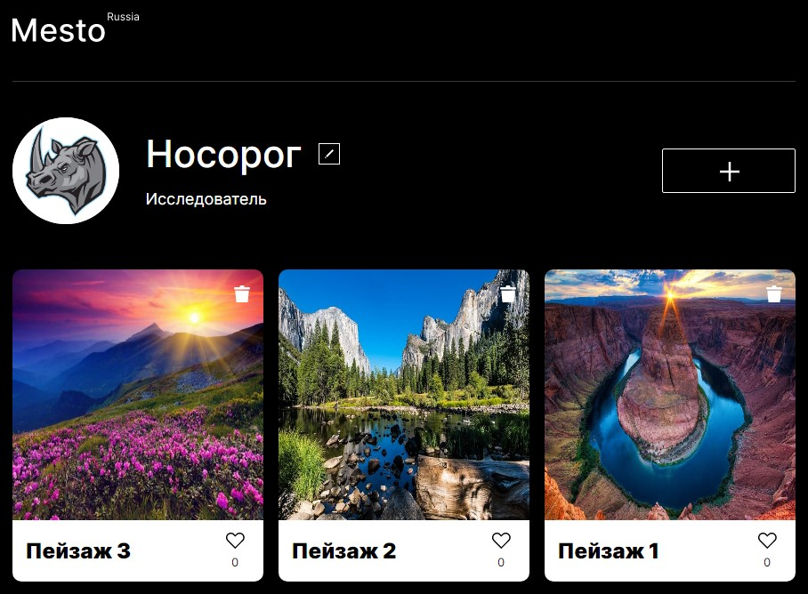

# Проект React-Mesto-Auth

<kbd>  </kbd>

### Описание:
Фронтенд проекта Mesto: 
> kshmr-mesto.nomoredomains.monster

[Макет проекта в Figma](https://www.figma.com/file/xfLxdR6oHfEAaSgrzIJARe/JavaScript.-Sprint-4?node-id=0%3A1 "ссылка на макет")

### Стек технологий:

| CSS <code></code> | JavaScript <code></code>| React <code></code>| 
|---|---|---|

>  Также в проекте используются `Flex`, `Grid`, `позиционирование`, `БЭМ` и т.д.

### Функциональность:
* Регистрация пользователя
* Авторизация пользователя
* Открытие/закрытие попапов
* Добавление/удаление карточки
* Редактирование профиля
* Редактирование аватара
* Постановка/снятие лайка
* Открытие картинки карточки в полноэкранном режиме
* Во всех строках ввода реализована валидация

### Инструкция по установке:
1. Установите [Node.js](https://nodejs.org/en/ "ссылка на сайт Node.js")
2. Установите [Git](https://git-scm.com/ "ссылка на сайт Git")
3. Скачайте архив данного репозитория или склонируйте себе при помощи команды:
```sh
git clone https://github.com/koshmar1319/react-mesto-auth.git
```
4. Установите все зависимости:
```sh
npm install
```
5. Запустить проект в режиме разработчика:
```sh
npm run start
```
6. Запустить проект в режиме production:
```sh
npm run build
```

### Демо:
> Github Pages <br/>[Ссылка на сайт :arrow_lower_right:](https://koshmar1319.github.io/react-mesto-auth/ "ссылка на сайт")  
